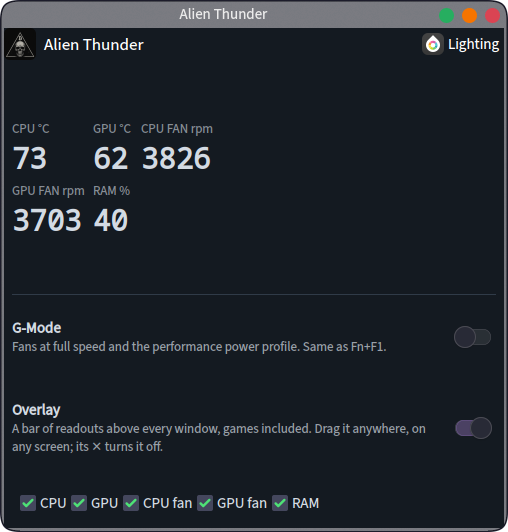
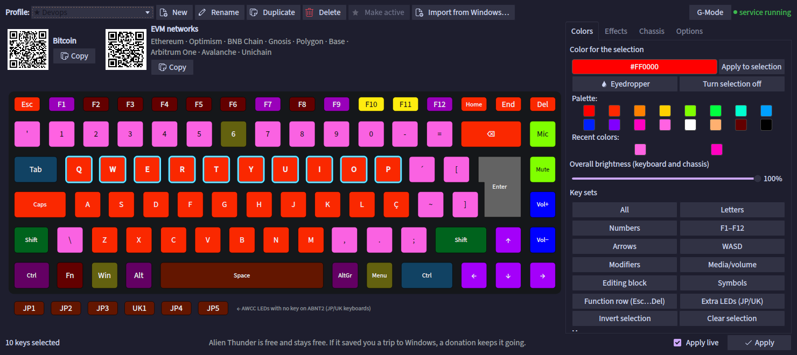

<p align="center"></p>

<h1 align="center">Alien Thunder</h1>

<p align="center"><b>The Alienware Command Center bits you miss on Linux: per-key lighting, the G-Mode key, and live temperatures and fan speeds, on your panel and floating over your games.</b></p>

---

## The problem

On Windows, Alienware laptops come with the Alienware Command Center. On Linux you
get none of it: the keyboard lights stay whatever color they were, the turbo key
(Fn+F1, G-Mode) does nothing, and there's no quick way to see how hot the CPU is or
how fast the fans are spinning.

## What Alien Thunder does

- **Lighting.** Color every key on its own, run effects, save profiles, and light the
  touchpad, the Alienhead on the lid and the power button. Your profile comes back at
  login, after suspend and when the keyboard reconnects.
- **G-Mode.** Fn+F1 works again: fans at full speed and the performance power profile,
  and the F1 key turns white while it's on, like on Windows.
- **Readouts on the panel.** CPU and GPU temperature, both fan speeds and memory in use,
  right next to the system tray and the clock.
- **Overlay.** The same readouts as small tiles that float above every window, games
  in fullscreen included. Drag each one anywhere, on any screen.

## How it looks

### On your panel

<p align="center"></p>

The icon gets a white **G** while G-Mode is on. Temperatures turn yellow at 75 °C and red
at 90 °C. Hover for a summary; click for the rest.

### Click it

<p align="center"></p>

G-Mode and the overlay are one switch each. **Lighting** opens the lighting editor.

### The overlay

<p align="center"></p>

Each tile is its own window, so they don't have to stay together: CPU in one corner,
fans in another, memory on the second monitor. Grab a tile and drop it wherever you
like; it remembers the spot and the screen. When they're where you want them, tick
**Lock in place** and clicks pass straight through them to whatever is below.

### The lighting editor

<p align="center"></p>

Click keys to select them (Ctrl+click toggles, drag selects an area), pick a color, and
the keyboard changes as you edit. Effects run either on the keyboard's own controller
(no CPU at all) or in the background service. **Import from Windows** reads the
presets you made in the Alienware Command Center, if your Windows partition is
mounted at `/mnt/windows`; it only reads, it never writes there.

## Install

```bash
git clone https://github.com/cryptoconspiracy/alien-thunder.git
cd alien-thunder
./install.sh
```

Nothing needs root. If a package is missing (PySide6, python-dbus, python-gobject,
layer-shell-qt, gettext), the installer says which and asks before installing it. It
puts the widget on your panel right before the system tray, starts the background
service, and adds **Alien Thunder** to the app menu.

### Updating

```bash
git pull && ./install.sh
```

### Removing

```bash
./uninstall.sh
```

Your lighting profiles stay in `~/.config/alien-thunder`.

## Will it work on my computer?

It was built on, and has only been tested on, an **Alienware m16 R2 with the Brazilian
(ABNT2) keyboard**, on Arch-based Linux with **KDE Plasma 6 on Wayland**.

- **Lighting** talks to two USB devices: the keyboard (0d62:d2b1) and the AW-ELC
  chassis controller (187c:0551). Other Alienware laptops with those same controllers
  may work; the key map is the ABNT2 one.
- **G-Mode** relies on the kernel's `alienware-wmi` driver, which turns G-Mode on when
  the power profile goes to *performance*, and on power-profiles-daemon. The key is
  read from `/dev/input`, so your user has to be in the `input` group.
- **Temperatures and fans** come from `alienware_wmi` and `coretemp`. The GPU reading is
  the laptop's embedded controller, not the NVIDIA driver, so checking it every two
  seconds doesn't wake a sleeping GPU.
- **The overlay** needs a Wayland compositor with the layer-shell protocol (KWin has it).
- **The panel widget** needs KDE Plasma 6.

## Language

Alien Thunder is in English and Brazilian Portuguese, and follows your system's
language. If your system is set to Portuguese but that locale isn't generated, KDE
falls back to English, and so does Alien Thunder, so the two always match.

## For the curious: the command line

```text
alien-thunder                    open the lighting editor
alien-thunder list               list the profiles (* = active)
alien-thunder set <profile>      make a profile the active one and apply it
alien-thunder status             service and device status
alien-thunder gmode [on|off|toggle]
alien-thunder overlay [on|off|lock|unlock|show ITEM|hide ITEM|status]
```

`ITEM` is one of `cpu_temp`, `gpu_temp`, `cpu_fan`, `gpu_fan`, `ram`.

## What's new

### 1.1

- Now called Alien Thunder (it was AlienFX Studio). Profiles move over by themselves.
- G-Mode on Fn+F1, with the white F1 key.
- Temperatures, fan speeds and memory on the panel, and the floating overlay.
- English and Brazilian Portuguese.

## Credits

- The lighting protocols come from [alienfx-tools](https://github.com/T-Troll/alienfx-tools)
  by T-Troll (MIT), and were checked byte for byte against alienrgb.
- The key layout comes from the Alienware Command Center's own drawing of the ABNT2 keyboard.
- G-Mode and the fan readings rely on the Linux kernel's `alienware-wmi` driver.
- The overlay uses KDE's [LayerShellQt](https://invent.kde.org/plasma/layer-shell-qt).

Made by Dan B. MIT license.
